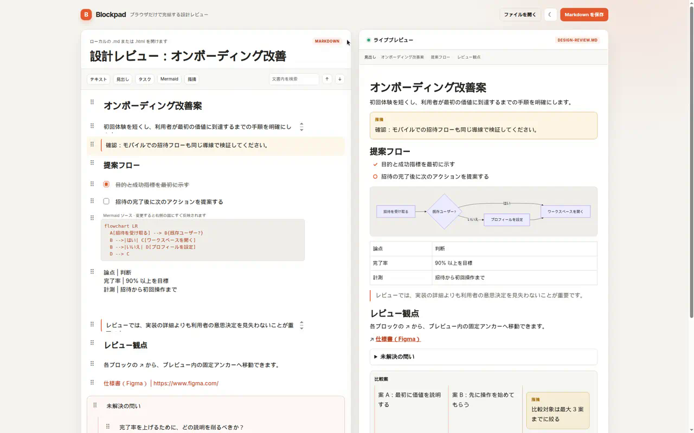
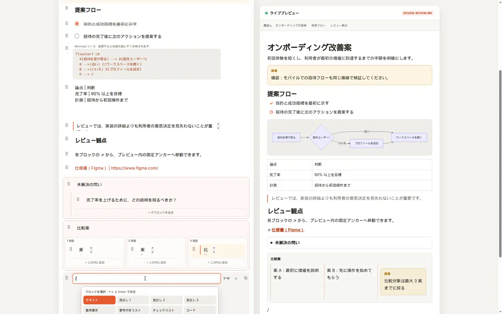
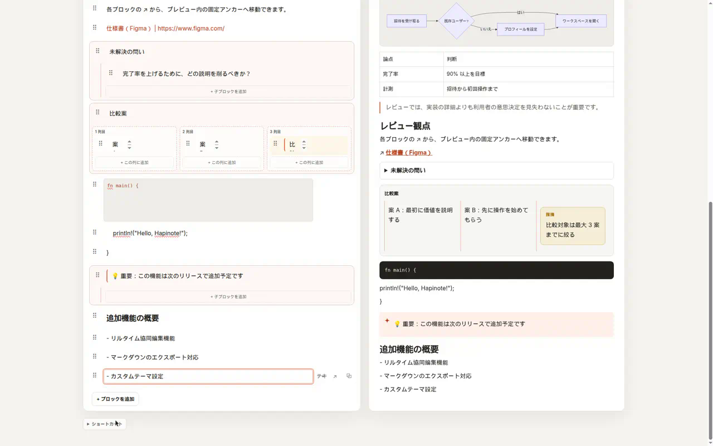
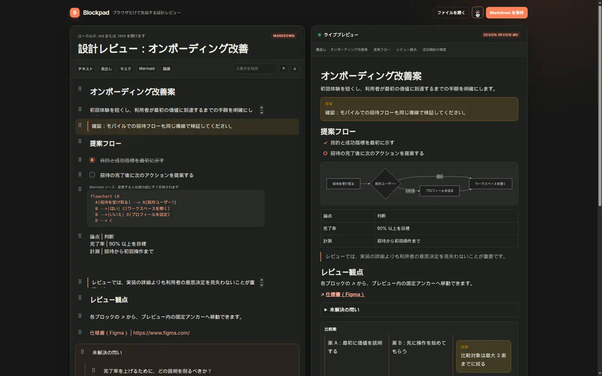
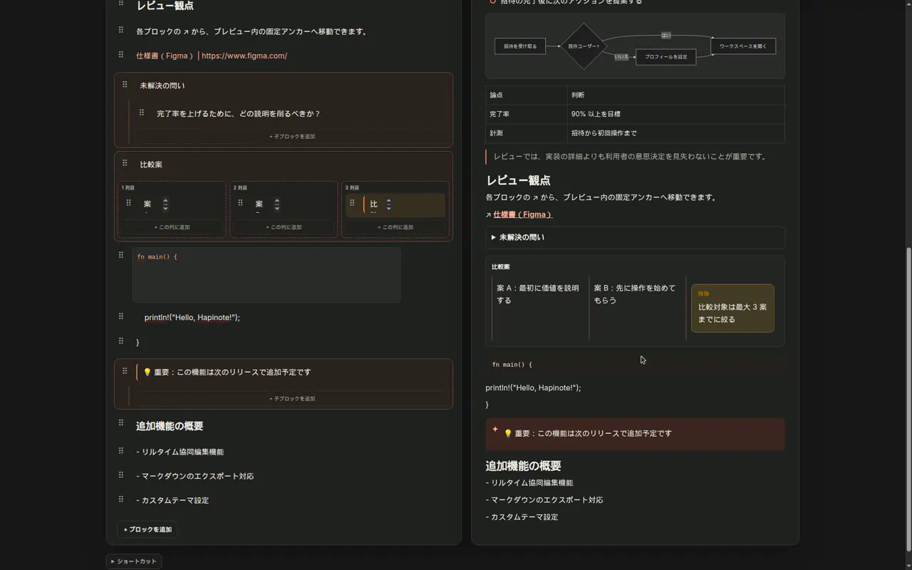

# MD Block Editor（Markdownブロックエディタ）

ローカルの `.md` / `.html` を、ブラウザだけで Notion 風ブロック編集するエディタです。サーバー・アカウント・データベースは使いません。

Cargo パッケージ名は `blockpad` のままです。公開名は **MD Block Editor / Markdownブロックエディタ** です。

## すぐ使う

ビルド済みファイルは Git には入れていません。[最新リリース](https://github.com/satoki252595/md-block-editor/releases/latest) から取ってください。ブラウザですぐ開くなら [GitHub Pages](https://satoki252595.github.io/md-block-editor/) です。

- Windows: `md-block-editor-windows-x64-setup.exe`
- Linux: `md-block-editor-linux-x86_64.AppImage`
- macOS (Apple Silicon): `md-block-editor-macos-arm64.dmg`
- どの OS でも: `md-block-editor-web.zip`（静的配信）または Pages

## できること

- `/` でスラッシュコマンド（見出し、リスト、コード、表、コールアウト、カラム、Mermaid、指摘など）
- 本文や行・範囲を選んでレビューし、LLM に返すプロンプト／JSON をコピー
- ラウンド差分（統合 / 分割）。前回コピーまたはレビュー完了時の文書と比較
- 指摘は対象ブロックの下にスレッド表示。解決 / 未解決。下書きはこのブラウザに自動保存
- **レビューを終えてコピー** で未解決指摘＋差分＋下書きをまとめたエージェント用プロンプト
- コメント JSON のコピーと保存。`レビューで開く` で手元の `.md` / `.html` をレビュー対象にする
- ドラッグハンドル、または `Alt + ↑` / `Alt + ↓` で並べ替え
- 右側のライブプレビュー（見出しアウトライン付き）
- トップバーの ☾ / ☀ でダークモード
- 日本語 IME の変換中にブロックを増やしたり消したりしない
- 対応ブラウザは File System Access で元ファイルへ上書き保存。非対応時はファイル選択 + ダウンロード

## 画面

編集とライブプレビュー:



スラッシュメニュー:



見出し・リスト・コード・コールアウト・カラム:



ダークモード:



ライブプレビュー（Mermaid・表・カラム）:



## 起動

```bash
rustup target add wasm32-unknown-unknown
cargo install dioxus-cli --locked
dx serve --platform web --addr 127.0.0.1 --port 43123
```

`http://127.0.0.1:43123` を開きます。

操作: `Enter` でブロック追加、`Shift + Enter` で改行。`Cmd/Ctrl + B` / `I` で強調。`/mermaid` で図、`/指摘` または `/comment` でレビュー指摘。`Cmd/Ctrl + Shift + R` で選択をレビュー。

## 選択してレビューし、LLMに返す

[Crit](https://github.com/tomasz-tomczyk/crit) と同じ本流です。対象を指して指摘を書き、その文面を LLM に貼り戻します。サーバーは使いません。`crit` CLI・アカウント・他アプリのプロキシはありません。

1. **ファイルを開く**、または **レビューで開く**（同じ選択。後者はレビューパネルを前面にする）
2. 本文をドラッグして選ぶ。またはブロック右の **レビュー**（Shift で範囲に追加）。行番号は部分選択に付く
3. 指摘を書く。空なら **下書きを生成**。下書きはリロード後もこのブラウザに残る
4. **指摘にする** で文書内の指摘ブロックになる。対象の直下にスレッドが出る。**解決** で未解決から外す
5. **LLMにコピー** は今の対象だけ。**レビューを終えてコピー** は未解決＋差分＋下書きの全文
6. **コメントJSONをコピー** / **保存** でスレッドを書き出す。差分は **統合** / **分割**

日本語 IME の変換中は選択を取り込みません。空・読み込み中・コピー失敗はパネルに出します。
